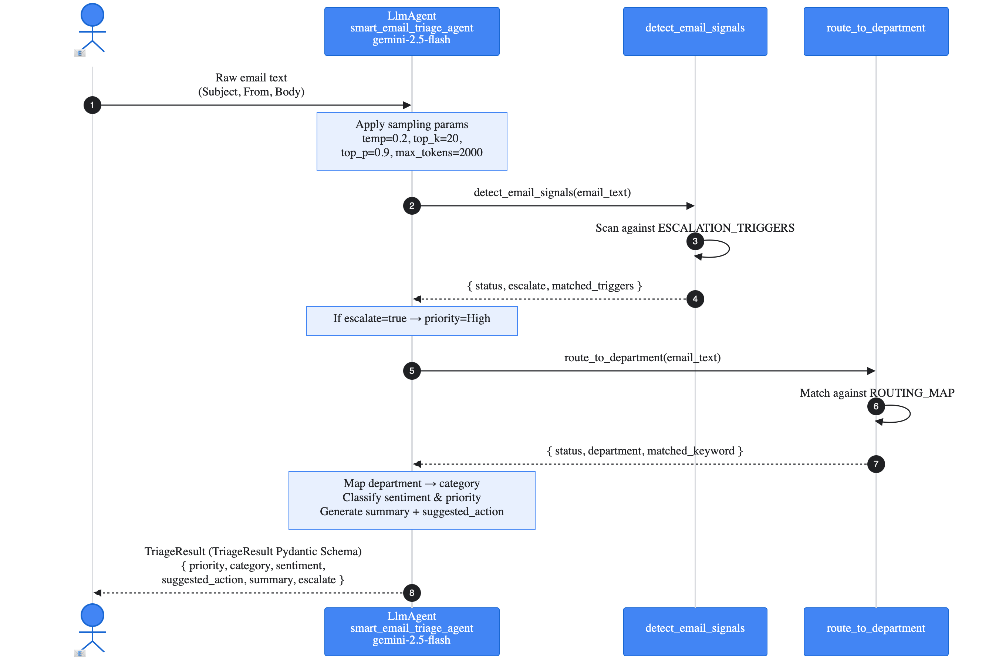

# Smart Email Triage Agent

An AI-powered email triage agent that acts as an **automated first-pass triage layer** for business inboxes — classifying, prioritizing, and routing emails with instant, consistent judgment.

Built with [Google Agent Development Kit (ADK)](https://google.github.io/adk-docs/) and powered by Gemini, it uses custom Python tools for escalation detection and department routing.

---

## The Problem

Every business receives a flood of emails daily — customer complaints, sales inquiries, spam, internal memos, billing disputes, feedback. These land in a shared inbox and someone has to manually read each one, decide how urgent it is, figure out which team should handle it, and route it accordingly.

This is slow, inconsistent, and expensive. A support agent reading 200 emails a day will categorize things differently depending on their mood, experience, or workload. High-priority complaints get buried. Legal threats go unnoticed. Sales leads sit unanswered for days.

---

## What This Agent Solves

The  agent acts as an automated first-pass triage layer. The moment an email arrives, the agent:

| Capability | Description |
|------------|-------------|
| **Classifies** | Support, Sales, Spam, Internal, Feedback, or Other |
| **Scores Priority** | High, Medium, or Low |
| **Reads Sentiment** | Positive, Neutral, Negative, or Urgent |
| **Flags Escalation** | Detects legal language or extreme dissatisfaction |
| **Suggests Action** | One clear action to take (max 15 words) |
| **Summarizes** | 1-2 sentence plain-English summary |

---

## Features

- **Instant classification** — categorize emails into 6 types (Support, Sales, Spam, Internal, Feedback, Other)
- **Priority scoring** — surface high-priority items immediately (High, Medium, Low)
- **Sentiment analysis** — understand customer emotional tone (Positive, Neutral, Negative, Urgent)
- **Escalation detection** — flag legal threats and churn risks before they escalate
- **Smart routing** — direct emails to the right department without human judgment
- **Structured output** — returns consistent `TriageResult` schema for easy integration

---

## Architecture

```
User
 |
 v
Smart Email Triage Agent  (Google ADK LlmAgent - Gemini)
 |
 +-- Tool: detect_email_signals
 |     Detects: legal threats, fraud, urgency, dissatisfaction
 |     Returns: {status, escalate, matched_triggers}
 |
 +-- Tool: route_to_department
       Maps keywords to teams (Billing, Engineering, Sales, etc.)
       Returns: {status, department, matched_keyword}
 |
 v
Structured TriageResult (Pydantic schema)
```

### Sequence Diagram



---

## Tools

### 1. detect_email_signals

| Detail | Value |
|--------|-------|
| Purpose | Detect signals for triage decisions |
| When to use | Call first on every email |
| Input | `email_text` (string) |
| Output | `{status, escalate, matched_triggers}` |

Scans the email for signals that inform triage decisions, including legal threats, urgency indicators, and expressions of dissatisfaction.

**Triggers detected:**
- Legal: `lawsuit`, `legal action`, `attorney`, `sue`, `court`
- Fraud: `fraud`, `chargeback`, `data breach`
- Dissatisfaction: `unacceptable`, `furious`, `threatening`

### 2. route_to_department

| Detail | Value |
|--------|-------|
| Purpose | Identify the appropriate team |
| When to use | Call after detect_email_signals |
| Input | `email_text` (string) |
| Output | `{status, department, matched_keyword}` |

Identifies the most appropriate internal department to handle this email based on keyword matching.

**Routing map:**

| Keyword | Department |
|---------|------------|
| refund, invoice, payment | Billing Team |
| bug, crash, error | Engineering Team |
| pricing, demo | Sales Team |
| cancel | Retention Team |
| complaint | Customer Success |
| partnership | Business Development |
| (no match) | General Support |

---

## Output Schema

The agent returns a structured `TriageResult` with these fields:

| Field | Type | Description |
|-------|------|-------------|
| `priority` | string | Urgency level: High, Medium, or Low |
| `category` | string | Email type: Support, Sales, Spam, Internal, Feedback, or Other |
| `sentiment` | string | Emotional tone: Positive, Neutral, Negative, or Urgent |
| `suggested_action` | string | One clear action to take, max 15 words |
| `summary` | string | 1-2 sentence plain-English summary of the email |
| `escalate` | boolean | True if this email requires immediate human escalation |

---

## Prerequisites

- Python >= 3.10
- [uv](https://docs.astral.sh/uv/) package manager
- A Google Cloud project with Vertex AI enabled

---

## Installing Prerequisites (From Scratch)

If you're starting from zero, follow these steps in order.

### 1. Install Python (≥ 3.10)

<details>
<summary><strong>macOS</strong></summary>

```bash
brew install python3
python3 --version
```

> Don't have Homebrew? Install it first: https://brew.sh
</details>

<details>
<summary><strong>Windows</strong></summary>

1. Download the installer from [python.org/downloads](https://www.python.org/downloads/)
2. Run it — **check "Add python.exe to PATH"**
3. Open a **new** terminal and verify:
```bash
python --version
```
</details>

<details>
<summary><strong>Linux (Debian/Ubuntu)</strong></summary>

```bash
sudo apt update && sudo apt install -y python3 python3-pip
python3 --version
```
</details>

### 2. Install uv (package manager)

<details>
<summary><strong>macOS / Linux</strong></summary>

```bash
curl -LsSf https://astral.sh/uv/install.sh | sh
```
</details>

<details>
<summary><strong>Windows (PowerShell)</strong></summary>

```powershell
powershell -ExecutionPolicy ByPass -c "irm https://astral.sh/uv/install.ps1 | iex"
```
</details>

Restart your terminal, then verify:
```bash
uv --version
```

### 3. Install Google Cloud CLI

<details>
<summary><strong>macOS</strong></summary>

```bash
brew install --cask google-cloud-sdk
```
</details>

<details>
<summary><strong>Windows / Linux</strong></summary>

Follow the official guide: [cloud.google.com/sdk/docs/install](https://cloud.google.com/sdk/docs/install)
</details>

Then authenticate:
```bash
gcloud init
gcloud auth application-default login
```

---

## Setup

### 1. Clone the repository

```bash
git clone <repo-url>
cd email_triage_agent
```

### 2. Create and activate a virtual environment

<details>
<summary><strong>macOS / Linux</strong></summary>

```bash
uv venv
source .venv/bin/activate
```
</details>

<details>
<summary><strong>Windows (PowerShell)</strong></summary>

```powershell
uv venv
.venv\Scripts\Activate.ps1
```
</details>

### 3. Install dependencies

```bash
uv sync
```

> This installs all project dependencies including Google ADK. The `adk` CLI will be available inside the virtual environment.

### 4. Configure environment variables

<details>
<summary><strong>macOS / Linux</strong></summary>

```bash
cp .env.example .env
```
</details>

<details>
<summary><strong>Windows (PowerShell)</strong></summary>

```powershell
copy .env.example .env
```
</details>

Then open `.env` and fill in your values:

`.env` variables:

| Variable | Description |
|----------|-------------|
| `GOOGLE_GENAI_USE_VERTEXAI` | Set to `1` to use Vertex AI |
| `GOOGLE_CLOUD_PROJECT` | Your GCP project ID |
| `GOOGLE_CLOUD_LOCATION` | GCP region (e.g. `us-central1`) |
| `MODEL` | Gemini model name (e.g. `gemini-2.5-flash`) |

### 5. Authenticate with Google Cloud

```bash
gcloud auth application-default login
```

---

## Running the Agent

Start the ADK web interface:

```bash
adk web
```

Then open [http://localhost:8000](http://localhost:8000) in your browser and select **email_triage_agent**.

Alternatively, run via CLI:

```bash
adk run email_triage_agent
```

---

## Deploying to Cloud Run

Deploy the agent to Google Cloud Run for production use.

### 1. Set environment variables

```bash
source .env
export SERVICE_NAME="email-triage-agent-service"
export APP_NAME="email_triage_agent"
export AGENT_PATH="./email_triage_agent"
```

### 2. Deploy with ADK CLI

```bash
adk deploy cloud_run \
  --project=$GOOGLE_CLOUD_PROJECT \
  --region=$GOOGLE_CLOUD_LOCATION \
  --service_name=$SERVICE_NAME \
  --app_name=$APP_NAME \
  --with_ui \
  $AGENT_PATH
```

### 3. Access the deployed agent

After deployment completes, the CLI will output a URL like:
```
https://email-triage-agent-service-xxxxxx-uc.a.run.app
```

### 4. View logs in Cloud Logging

The agent emits structured logs with the prefix `EMAIL_TRIAGE_AGENT:` for easy filtering.

**GCP Console query:**
```
resource.type="cloud_run_revision"
resource.labels.service_name="email-triage-agent-service"
textPayload=~"EMAIL_TRIAGE_AGENT:"
```

**Filter by log type:**

| Filter | Shows |
|--------|-------|
| `EMAIL_TRIAGE_AGENT:INPUT` | User prompts |
| `EMAIL_TRIAGE_AGENT:OUTPUT` | Agent responses |
| `EMAIL_TRIAGE_AGENT:TOOL_CALL` | Tool invocations |
| `EMAIL_TRIAGE_AGENT:TOOL_RESULT` | Tool outputs (JSON) |
| `EMAIL_TRIAGE_AGENT:ESCALATION` | Escalation alerts |
| `EMAIL_TRIAGE_AGENT:ROUTING` | Department routing decisions |

**CLI example:**
```bash
gcloud logging read 'textPayload=~"EMAIL_TRIAGE_AGENT:ESCALATION"' \
  --project=$GOOGLE_CLOUD_PROJECT \
  --limit=50
```

Or view in the [GCP Console](https://console.cloud.google.com/logs).

### 5. Undeploy the agent

To delete the Cloud Run service:

```bash
source .env
gcloud run services delete email-triage-agent-service \
  --project=$GOOGLE_CLOUD_PROJECT \
  --region=$GOOGLE_CLOUD_LOCATION \
  --quiet
```

---

## Example Interactions

```
User: Please triage this email:

      Subject: URGENT - Unacceptable Service - Legal Action Impending
      Body: I have been a customer for 5 years and this is the worst 
      experience I've ever had. My account was charged THREE times for 
      the same order. I've called your support line 4 times and no one 
      can help. If this isn't resolved by Friday, my attorney will be 
      filing a complaint with the state attorney general's office.
      I expect a full refund AND compensation for my time.
      From: john.smith@techcorp.com

Agent: {
         "priority": "High",
         "category": "Support",
         "sentiment": "Negative",
         "suggested_action": "Escalate to legal team and process refund immediately",
         "summary": "Long-term customer threatening legal action over triple-charge 
                     billing error after 4 failed support contacts. Demands full 
                     refund plus compensation with Friday deadline.",
         "escalate": true
       }
```

---

## Project Structure

```
email_triage_agent/
├── email_triage_agent/
│   ├── __init__.py       # Package initialization
│   ├── agent.py          # Main agent definition (root_agent)
│   ├── prompts.py        # System instructions
│   └── tools.py          # Custom tools (detect_email_signals, route_to_department)
├── .env                  # Environment variables (not committed)
├── .env.example          # Environment variable template
├── pyproject.toml        # Project configuration
├── uv.lock               # Dependency lock file
└── README.md             # This file
```

---

## Integration

The agent returns a Pydantic-validated `TriageResult` object, making it easy to integrate with:

- Ticketing systems (Zendesk, Freshdesk, Intercom)
- CRM platforms (Salesforce, HubSpot)
- Custom webhooks and APIs

### API Usage Example

```python
from google.adk.runners import InMemoryRunner
from email_triage_agent.agent import root_agent

async def triage_email(subject: str, body: str, sender: str) -> dict:
    runner = InMemoryRunner(agent=root_agent)
    
    prompt = f"""
    Please triage this email:
    Subject: {subject}
    Body: {body}
    From: {sender}
    """
    
    async for event in runner.run_async(user_id="system", prompt=prompt):
        if hasattr(event, 'content'):
            return event.content
```
