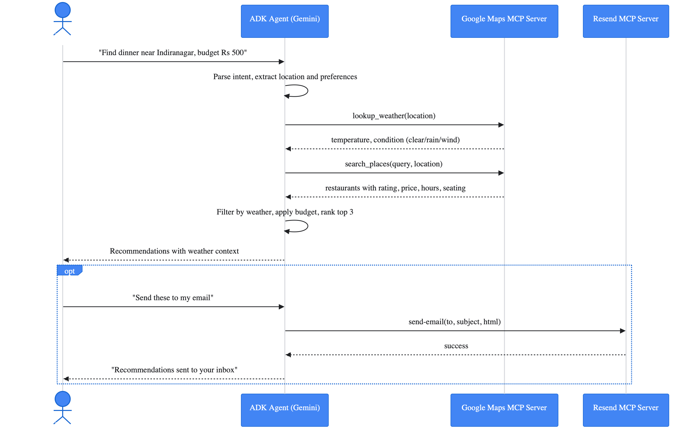

# WeatherEats Agent 🍽️🌤️

An AI-powered restaurant discovery agent that combines **live weather data** and **real-time places search** to deliver context-aware dining recommendations — and optionally emails them to you.

Built with [Google Agent Development Kit (ADK)](https://google.github.io/adk-docs/) and powered by Gemini, it connects to external services exclusively through **Model Context Protocol (MCP)** servers.

---

## The Problem

Finding the right restaurant is harder than it should be. You search for "best restaurants near me" and get a list, but it doesn't consider the weather — recommending a rooftop bar when it's pouring rain, or a cozy indoor spot when the weather is perfect for outdoor dining.

People end up making poor dining choices, arriving at restaurants that don't match the conditions, or spending too much time researching and cross-referencing weather apps with restaurant reviews.

---

## What This Agent Solves

The agent acts as a context-aware dining concierge. When you ask for restaurant recommendations, the agent:

| Capability | Description |
|------------|-------------|
| **Checks Weather** | Fetches live weather conditions for your location |
| **Searches Places** | Finds real restaurants via Google Maps (no hallucinated data) |
| **Filters by Context** | Rain → indoor venues, Sunny → rooftop/outdoor suitable |
| **Ranks Results** | Prioritizes by rating, weather-fit, and your preferences |
| **Emails Results** | Optionally sends recommendations to your inbox |

---

## Features

- 🌦️ **Live weather lookup** before every restaurant search — recommendations adapt to current conditions (rain → indoor, sunny → rooftop, etc.)
- 🗺️ **Real-time restaurant search** via Google Maps Places — no hallucinated data, only live results
- 📧 **Email delivery** of recommendations via Resend
- 🔁 **Follow-up queries** — refine by cuisine, budget, or preference without re-entering your location
- 🛡️ **Safety guardrails** — content filtering enabled across all harm categories

---

## Architecture

```
User
 │
 ▼
WeatherEats Agent  (Google ADK LlmAgent — Gemini)
 ├── MCP Toolset: Google Maps MCP  (Streamable HTTP)
 │    ├── lookup_weather
 │    └── search_places
 └── MCP Toolset: Resend MCP       (stdio / npx)
      └── send-email
```

### Sequence Diagram



---

## MCP Servers

### 1. Google Maps MCP (`mapstools.googleapis.com/mcp`)

| Detail | Value |
|---|---|
| Transport | Streamable HTTP |
| Auth | `X-Goog-Api-Key` header |
| Tools used | `lookup_weather`, `search_places` |

Provides live weather conditions and nearby restaurant data. The agent always calls `lookup_weather` first to determine the dining context (indoor/outdoor suitability), then calls `search_places` to retrieve real restaurant listings.

### 2. Resend MCP (`resend-mcp` via npx)

| Detail | Value |
|---|---|
| Transport | stdio |
| Package | [`resend-mcp`](https://www.npmjs.com/package/resend-mcp) |
| Tools used | `send-email` |

Handles email delivery of recommendations. Launched as a child process via `npx -y resend-mcp`, with `RESEND_API_KEY` and `SENDER_EMAIL_ADDRESS` injected via environment variables.

> **Note:** On Resend's free tier with `onboarding@resend.dev` as the sender, emails can only be delivered to the address registered with your Resend account. To send to any recipient, [verify a custom domain](https://resend.com/domains) and update `SENDER_EMAIL_ADDRESS`.

---

## Prerequisites

- Python ≥ 3.12
- [uv](https://docs.astral.sh/uv/) package manager
- Node.js + `npx` (for the Resend MCP server)
- A Google Cloud project with Vertex AI enabled
- A [Google Maps API key](https://console.cloud.google.com/google/maps-apis) with Maps and Places APIs enabled
- A [Resend](https://resend.com) account and API key

---

## Installing Prerequisites (From Scratch)

If you're starting from zero, follow these steps in order.

### 1. Install Python (≥ 3.12)

<details>
<summary><strong>macOS</strong></summary>

```bash
brew install python3
python3 --version
```

> Don't have Homebrew? Install it first: https://brew.sh
</details>

<details>
<summary><strong>Windows</strong></summary>

1. Download the installer from [python.org/downloads](https://www.python.org/downloads/)
2. Run it — **check "Add python.exe to PATH"**
3. Open a **new** terminal and verify:
```bash
python --version
```
</details>

<details>
<summary><strong>Linux (Debian/Ubuntu)</strong></summary>

```bash
sudo apt update && sudo apt install -y python3 python3-pip
python3 --version
```
</details>

### 2. Install uv (package manager)

<details>
<summary><strong>macOS / Linux</strong></summary>

```bash
curl -LsSf https://astral.sh/uv/install.sh | sh
```
</details>

<details>
<summary><strong>Windows (PowerShell)</strong></summary>

```powershell
powershell -ExecutionPolicy ByPass -c "irm https://astral.sh/uv/install.ps1 | iex"
```
</details>

Restart your terminal, then verify:
```bash
uv --version
```

### 3. Install Node.js (needed for Resend MCP)

<details>
<summary><strong>macOS</strong></summary>

```bash
brew install node
```
</details>

<details>
<summary><strong>Windows</strong></summary>

Download the LTS installer from [nodejs.org](https://nodejs.org/) and run it.
</details>

<details>
<summary><strong>Linux (Debian/Ubuntu)</strong></summary>

```bash
sudo apt install -y nodejs npm
```
</details>

Verify:
```bash
node --version
npx --version
```

### 4. Install Google Cloud CLI

<details>
<summary><strong>macOS</strong></summary>

```bash
brew install --cask google-cloud-sdk
```
</details>

<details>
<summary><strong>Windows / Linux</strong></summary>

Follow the official guide: [cloud.google.com/sdk/docs/install](https://cloud.google.com/sdk/docs/install)
</details>

Then authenticate:
```bash
gcloud init
gcloud auth application-default login
```

---

## Setup

### 1. Clone the repository

```bash
git clone <repo-url>
cd weather_eats_agent
```

### 2. Create and activate a virtual environment

<details>
<summary><strong>macOS / Linux</strong></summary>

```bash
uv venv
source .venv/bin/activate
```
</details>

<details>
<summary><strong>Windows (PowerShell)</strong></summary>

```powershell
uv venv
.venv\Scripts\Activate.ps1
```
</details>

### 3. Install dependencies

```bash
uv sync
```

> This installs all project dependencies including Google ADK. The `adk` CLI will be available inside the virtual environment.

### 4. Configure environment variables

<details>
<summary><strong>macOS / Linux</strong></summary>

```bash
cp .env.template .env
```
</details>

<details>
<summary><strong>Windows (PowerShell)</strong></summary>

```powershell
copy .env.template .env
```
</details>

Then open `.env` and fill in your values:

| Variable | Description |
|---|---|
| `GOOGLE_GENAI_USE_VERTEXAI` | Set to `1` to use Vertex AI |
| `GOOGLE_CLOUD_PROJECT` | Your GCP project ID |
| `GOOGLE_CLOUD_LOCATION` | GCP region (e.g. `us-central1`) |
| `MODEL` | Gemini model name (e.g. `gemini-2.5-flash-lite`) |
| `GOOGLE_MAPS_API_KEY` | Google Maps API key |
| `MAPS_MCP_URL` | Google Maps MCP endpoint URL |
| `RESEND_API_KEY` | Resend API key |
| `SENDER_EMAIL_ADDRESS` | Sender email address for Resend |

### 5. Authenticate with Google Cloud

```bash
gcloud auth application-default login
```

---

## Running the Agent

Start the ADK web interface:

```bash
adk web
```

Then open [http://localhost:8000](http://localhost:8000) in your browser and select **weather_eats_agent**.

---

## Deploying to Cloud Run

Deploy the agent to Google Cloud Run for production use.

### 1. Set environment variables

<details>
<summary><strong>macOS / Linux</strong></summary>

```bash
source .env
export SERVICE_NAME="weather-eats-agent-service"
export APP_NAME="weather_eats_agent"
export AGENT_PATH="./weather_eats_agent"
```
</details>

<details>
<summary><strong>Windows (PowerShell)</strong></summary>

```powershell
Get-Content .env | ForEach-Object { if ($_ -match '^\s*([^#][^=]+)=(.*)$') { [System.Environment]::SetEnvironmentVariable($matches[1].Trim(), $matches[2].Trim()) } }
$env:SERVICE_NAME = "weather-eats-agent-service"
$env:APP_NAME = "weather_eats_agent"
$env:AGENT_PATH = ".\weather_eats_agent"
```
</details>

### 2. Deploy with ADK CLI

```bash
adk deploy cloud_run \
  --project=$GOOGLE_CLOUD_PROJECT \
  --region=$GOOGLE_CLOUD_LOCATION \
  --service_name=$SERVICE_NAME \
  --app_name=$APP_NAME \
  --with_ui \
  $AGENT_PATH
```

### 3. Access the deployed agent

After deployment completes, the CLI will output a URL like:
```
https://weather-eats-agent-service-xxxxxx-uc.a.run.app
```

### 4. View logs in Cloud Logging

The agent emits structured logs with the prefix `WEATHER_EATS_AGENT:` for easy filtering.

**GCP Console query:**
```
resource.type="cloud_run_revision"
resource.labels.service_name="weather-eats-agent-service"
textPayload=~"WEATHER_EATS_AGENT:"
```

**Filter by log type:**

| Filter | Shows |
|--------|-------|
| `WEATHER_EATS_AGENT:STARTUP` | Agent initialization |
| `WEATHER_EATS_AGENT:CONFIG` | Configuration details |
| `WEATHER_EATS_AGENT:INPUT` | User prompts |
| `WEATHER_EATS_AGENT:OUTPUT` | Agent responses |
| `WEATHER_EATS_AGENT:SUMMARY` | Request/response summary |
| `WEATHER_EATS_AGENT:TOOL_CALL` | MCP tool invocations |

---

## Example Interactions

```
User: Suggest dining options in Connaught Place, New Delhi.

Agent: The weather in Connaught Place is cloudy at 23.8°C — all dining
       settings are suitable.

       1. The Imperial Spice — 4.5 stars | ₹1800/person | Indoor | 12:00–23:30
          Fine dining experience well-suited for a pleasant cloudy evening.
       ...

       Would you like me to send these recommendations to your email?
```

```
User: Show me only vegetarian options under ₹500.

Agent: [calls search_places with refined filters, returns fresh results]
```

---

## Project Structure

```
Track_2/
├── weather_eats_agent/
│   ├── __init__.py
│   ├── agent.py          # Agent definition, MCP toolset wiring
│   └── prompts.py        # System instruction for the LLM
├── .env.template         # Environment variable template
├── .gitignore
├── pyproject.toml
└── README.md
```

---

## Security

- `.env` is excluded from version control via `.gitignore`
- API keys are read from environment variables — never hardcoded
- All four Gemini harm categories are blocked at `BLOCK_LOW_AND_ABOVE`
- Restaurant data is sourced exclusively from live tool calls — the LLM is explicitly prohibited from using training knowledge for place data
